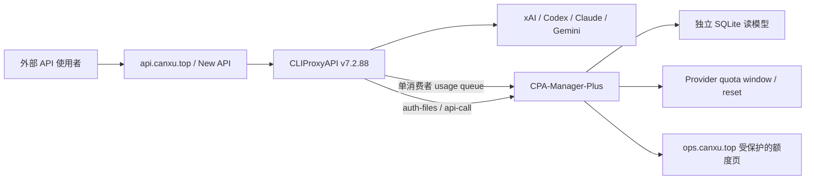

# 逐凭据额度与用量看板调研

核验时间：2026-07-31。这里的“额度”必须拆成三类，否则会再次把文件数或健康状态
误当成可用余额。

| 指标 | 回答的问题 | 数据来源 |
|---|---|---|
| Provider quota | 这个 OAuth 账号在 5 小时、周或月窗口还剩多少，何时重置 | 各 provider 官方 quota/usage 端点 |
| Gateway usage | 经当前网关实际发生多少请求、token、成本、延迟和失败 | CLIProxy usage queue / request logger |
| Auth health | 凭据是否 enabled、过期、被拒、冷却或 unavailable | CLIProxy auth-files 与探活结果 |

`ops.canxu.top` 的 `ACTIVE`、CLIProxy auth JSON 数和 `verified` 也属于不同口径；任何新
看板都应分别显示来源和更新时间。

## 现网与官方能力

- OVH 当前 CLIProxyAPI 为 `v7.2.88`（运行二进制现场核验）。
- [CLIProxyAPI](https://github.com/router-for-me/CLIProxyAPI) 最新正式版本为
  `v7.2.112`。官方 README 明确说明从 `v6.10.0` 起不再内置 usage statistics，而是推荐
  外接 CPA Usage Keeper 或 CPA-Manager-Plus。
- Management API 可以提供 auth-files、usage queue、API-key usage 和受控的 provider
  API 调用能力，但它本身不是截图所示的逐账号历史看板。

所以 CLIProxyAPI 可以继续做凭据池与数据面，不需要为了看板更换；额度展示应作为独立
读模型接在 Management API 之后。

## 开源候选

### 1. CPA-Manager-Plus：推荐用于 OVH 中央看板

- 仓库：[seakee/CPA-Manager-Plus](https://github.com/seakee/CPA-Manager-Plus)
- 核验版本：`v1.11.11`（2026-07-31）。
- 将消费型 usage queue 持久化到 SQLite，并按 account、credential、provider、model、
  API key、project、channel 和时间范围统计 calls、tokens、cost、latency、failures。
- 可展示 provider quota window/reset evidence、credential state 和 provider health
  signal（具体 provider 有端点时）。
- 推荐 CLIProxyAPI `v7.1.39+`，usage queue 要求 `v6.10.8+`；现网 `v7.2.88` 满足。

它最接近截图中的中央账号列表和进度条，并且适合继续接到 `ops.canxu.top` 的受保护入口。

### 2. CLIProxy Quota Tray：推荐用于桌面快速核验

- 仓库：[ZYHUO/CLIProxy-Quota-Tray](https://github.com/ZYHUO/CLIProxy-Quota-Tray)
- 核验版本：`v1.0.0`（2026-07-20）。
- Windows/Linux Electron 托盘，支持 ChatGPT/Codex、Claude、Gemini、Grok、Kimi、
  Cursor 等 provider 的真实窗口，以及本地 30 天 usage/cost 历史。
- 通过 `/auth-files?all=true`、`/usage-queue`、`/api-key-usage` 和 `/api-call` 工作。
- quota 默认缓存约 20 分钟；usage queue 约每 30 秒消费并写本地 JSONL。

它适合个人电脑查看，不适合作为 OVH 上所有使用者共享的中央 Web 控制台。

### 3. CLIProxyAPIPlus：本项目暂不采用

- 仓库：[kaitranntt/CLIProxyAPIPlus](https://github.com/kaitranntt/CLIProxyAPIPlus)
- 核验版本：`v7.2.105-1`（2026-07-29）。
- fork 恢复 usage logger 和 CPAMC dashboard，但要承担持续跟随上游安全、协议和发布的
  维护成本。

当前只缺看板，不值得为此更换数据面 fork。保留官方 CLIProxyAPI，加一个独立读模型更
容易回滚，也不影响现有 API 流量。

## 推荐架构

### 关键约束

1. `usage-queue` 是消费型队列，只允许一个正式消费者。不要同时让 Quota Tray、
   CPA-Manager-Plus 和自写任务各自读取，否则统计会被分流。
2. Manager 与 CLIProxy 同机走 loopback；Management key 只放在独立 `0600` secret，
   不进入浏览器、前端 JSON、日志或数据库。
3. 外部只开放 Manager 的只读页面，并复用现有身份保护；Management API 不直接暴露公网。
4. 每行至少展示 masked account、provider、auth health、quota 百分比/重置时间、24h
   requests/tokens、最近失败和数据更新时间。provider 没有 quota 端点时显示“未知”，
   不用本地 token 估算冒充官方余额。
5. 新 Manager 是旁路观测组件。停止它不能影响 CLIProxy、New API 或注册任务。

## 建议上线步骤

1. 先备份 CLIProxy 配置并确认 Management API 仅 loopback 可达。
2. 用独立目录和 volume 部署 CPA-Manager-Plus，先关闭所有写凭据/自动清理动作。
3. 只启用一个 usage queue 消费者，抽样对账 24 小时请求数、token 和失败数。
4. 再开启 provider quota 读取，逐 provider 核验 window、reset time 和缓存时间。
5. 通过 `ops.canxu.top` 增加受保护的只读路由；做 API 数据面、注册面板和旧 controller
   回归后再保留。

完成定义：同一 masked 凭据能同时看到 auth health、provider-reported quota 和本地
request/token 使用量，并且三者各有明确来源与 freshness；关闭看板后生产数据面无变化。
