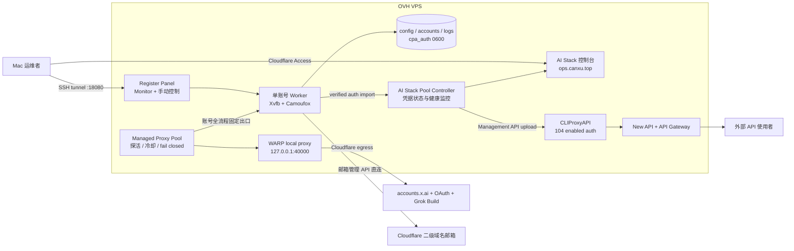
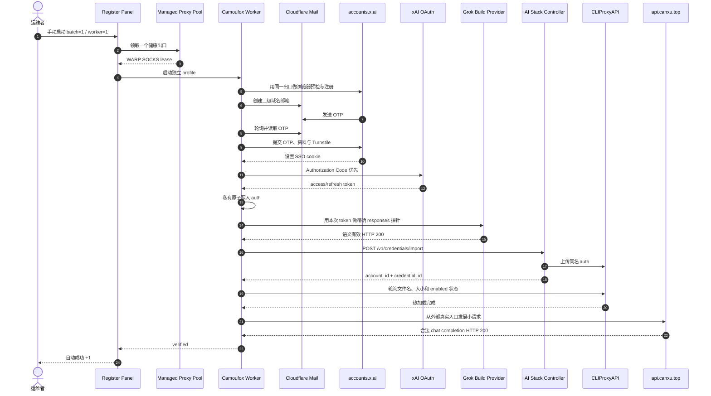
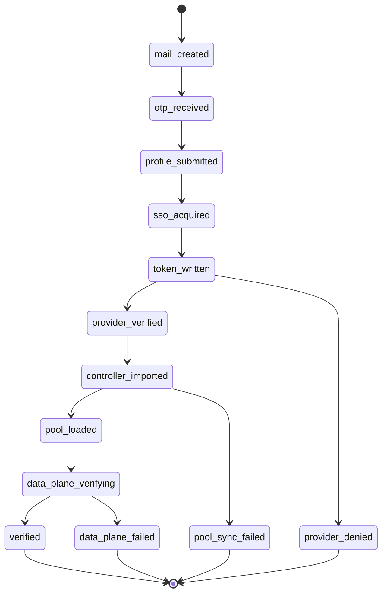
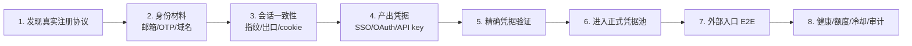

# 注册系统架构与运行流程

本文描述 2026-08-01 在 OVH 上实际运行的架构、一次完整注册如何成为外部可用凭据、
之前问题的分层根因，以及后续可复用到其他网站的工程方法。

## 1. 证据口径

| 标记 | 含义 |
|---|---|
| 已实测 | 当前 OVH 有日志、状态或真实 HTTP 结果 |
| 源码确认 | register-panel、AI Stack 或官方文档能确认 |
| 社区经验 | LINUX DO 的近期实践，只作为 canary 假设 |
| 工程推断 | 根据证据设计，仍需更多样本验证 |

当前关键版本：

- register-panel：`7af0e72`
- AI Stack controller 文件名契约：`f31b737`
- Trellis：`v1.1.0`
- Cloudflare WARP：`2026.6.880.0`

参考：

- [LINUX DO 原始教程 2673498](https://linux.do/t/topic/2673498)
- [近期 WARP/子域名讨论 2680750](https://linux.do/t/topic/2680750)
- [Cloudflare WARP modes](https://developers.cloudflare.com/warp-client/warp-modes/)
- [Cloudflare WARP Linux 安装](https://developers.cloudflare.com/warp-client/get-started/linux/)

社区帖子说明“哪些组合值得试”，官方文档说明 WARP local proxy 的真实网络边界；两者都
不能代替当前 OVH 的单账号验收。

## 2. 当前生产架构

### 网络边界

- WARP 使用 local proxy mode；只有显式传入 `socks5h://127.0.0.1:40000` 的注册浏览器、
  OAuth 和精确探针走 Cloudflare 出口。
- 宿主机默认路由仍是 `ens3`。AI Stack、SSH、邮箱管理 API 和 loopback 管理调用没有被
  全局改道。
- loopback 请求由代码明确跳过外部 proxy，防止 controller/CLIProxy 调用绕远路。
- WARP 是 Cloudflare 网络出口，不是住宅 ASN，也不是“每账号自动换 IP”的动态住宅池。

### 数据存放位置

| 数据 | 位置 | 说明 |
|---|---|---|
| 邮箱、SSO、注册结果 | OVH `/opt/grok-register-panel/accounts` | 私有运行材料，不进 Git |
| 面板 auth | OVH `/opt/grok-register-panel/cpa_auth` | 原子写入，目录 0700、文件 0600 |
| 恢复与状态日志 | OVH `/opt/grok-register-panel/log` | JSON/JSONL 是审计流，不是任务数据库 |
| 受管代理 | OVH `log/proxy_pool.json` | 含敏感连接材料，API 只返回脱敏视图 |
| 凭据业务状态 | AI Stack PostgreSQL | controller 的 ACTIVE/COOLDOWN/QUARANTINED/RETIRED |
| 可调度 auth | CLIProxy auth volume | 数据面实际加载的 OAuth 文件 |
| 本地 checkout | Mac Git 仓库 | 代码、文档和测试；不保存生产账号或 token |

## 3. 完整注册到外部可用的流程

### 为什么需要四道门

1. **精确 provider**：证明新 token 自己能用，不是旧池里的健康凭据代答。
2. **controller import**：让凭据进入 AI Stack 的生命周期和健康监控。
3. **CLIProxy 热加载**：证明数据面真的看见同名、同大小、enabled 的文件。
4. **公网数据面**：证明外部用户实际调用的 gateway/New API/CLIProxy 全链正常。

只有第四步完成后才是 `verified`。邮箱注册成功、SSO 落盘、token 写出或通用 API `200`
都只是中间状态。

## 4. 状态机

失败后保留私有 SSO/auth 供恢复。恢复流程只重做 OAuth、验证和同步，不重复创建邮箱和
账号；只有 `verified` 才从 `sso_pending` 原子出队。

## 5. 之前问题的分层根因

| 层 | 现象 | 根因 | 当前处理 |
|---|---|---|---|
| HTTP 指纹 | 普通 `curl` signup 返回 403 | 边缘 WAF 区分裸 HTTP/TLS 与浏览器请求，不是 OVH IP 完全断网 | Chrome-compatible 预检 + Camoufox 正式流程 |
| 浏览器挑战 | OVH 直连停在 `wait-cf:0` | 当前直连会话没有通过资料页 Turnstile，发生在 SSO 之前 | worker 走健康 WARP local proxy；单 canary 已通过 |
| 旧代理 | 历史代理样本返回 407 | 供应商授权/余额或凭据失效 | 不再作为当前出口；受管池为空时 fail closed |
| OAuth | Device token 已签发但 provider 403 | token 能签发不代表 Grok Build eligibility；Device 与 Build 上下文不同 | Authorization Code 优先，Device 仅回退 |
| 探针 | HTTP 200 仍判失败 | 2/16 token 预算令有效响应成为 `status=incomplete` | 精确 `pong` + 128 token，继续拒绝 incomplete |
| 状态分叉 | CLIProxy 有文件，控制台没有新账号 | 面板绕过 controller 直传 | verified 路径统一调用 controller import |
| 输入契约 | controller import 422 | CLIProxy 文件名含 `@`，模型正则不接受 | 允许 `@`，仍禁止路径字符 |
| 恢复出口 | 注册成功，恢复又失败 | 恢复子进程没有继承 managed proxy | 复用同一健康代理快照，空池 fail closed |

这些错误分别属于指纹、出口、OAuth eligibility、响应语义、状态同步和恢复上下文。把它们
统称为“网络问题”会导致错误重试。

## 6. 为什么这次能闭环

不是单一“换 IP”起作用，而是以下条件同时成立：

1. 已有 Cloudflare 二级域名邮箱服务被正确接回新面板；
2. Camoufox 保持浏览器指纹，受管 WARP 出口覆盖注册到 OAuth 的同一会话；
3. Authorization Code 生成适用于 Grok Build 的 token；
4. 精确探针预算足够完成响应，语义校验没有降低；
5. controller import、CLIProxy 热加载和公网数据面成为同一成功事务；
6. 恢复任务继承注册出口，避免“前半程一个网络、后半程另一个网络”。

**已实测事实：** 单账号完整闭环成功。

**工程推断：** WARP 解决了本次直连挑战路径。

**未知项：** 连续多天成功率、出口声誉变化和真实动态住宅的增益尚未测量。

## 7. 当前耗时

| 阶段 | 当前样本 |
|---|---:|
| 新账号启动到 Device token 结果 | 约 59 秒 |
| 同一 SSO Authorization Code 恢复到 `verified` | 约 7 秒 |
| 两段有效执行时间合计 | 约 66 秒 |
| 历史完整成功样本 | 约 70 秒 |

由于中间有人工诊断间隔，墙钟总时间不能用来代表自动化速度。当前合理容量口径仍是每个
`verified` 约 50 至 80 秒，而不是页面提交耗时。一个样本不足以承诺 P95。

## 8. 动态住宅与静态住宅的通俗解释

- **注册像办新手机号。** 网站最关心“这个申请动作是否像正常个人”，所以需要干净、
  稳定到足以完成一次会话、且账号之间可以更换的出口。这就是动态住宅 + sticky session
  的价值。
- **长期使用像固定上班地址。** 账号已经创建后，频繁换城市、运营商或 ASN 反而异常，
  所以长期调用更适合稳定出口。
- **WARP 是中间方案。** 它让注册流量离开 OVH 机房出口，但出口属于 Cloudflare，既不
  等于住宅网络，也不保证下一账号自动换 IP。

当前没有证据要求立刻购买动态住宅。先收集单账号 canary 的成功率；只有 WARP 持续失败
且失败域确实是出口信誉时，再引入受管住宅 gateway。

## 9. 可复用到其他网站的方法论

通俗说就是：先证明“能注册”，再证明“新凭据自己能用”，然后证明“放进池后外面真的
能调用”，最后才允许自动计成功和扩并发。每层保留独立错误码、时间和恢复动作，避免
从头重复注册。

## 10. 当前边界

- 自动注册关闭；没有后台批量任务。
- 生产继续限制 1 worker；更多并发需要持久 lease 和至少两个独立健康出口。
- controller `ACTIVE=103` 与 CLIProxy `enabled=104` 仍有 1 条历史差异待盘点。
- SQLite 任务账本、逐凭据额度页面和真实动态住宅尚未实现。
- 旧 AI Stack 组件按用户决定保留，不做资源收敛。

更细的持久化、lease、冷却和收敛方案见
[系统收敛、动态出口与可靠性闭环](CONVERGENCE_AND_GAPS.md)。
