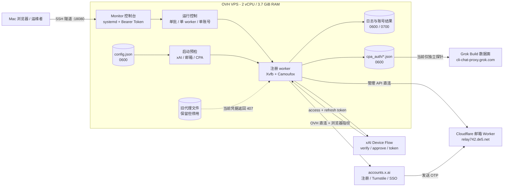
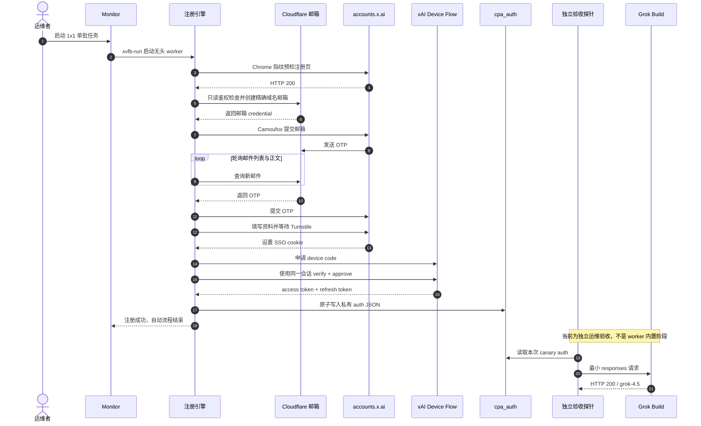
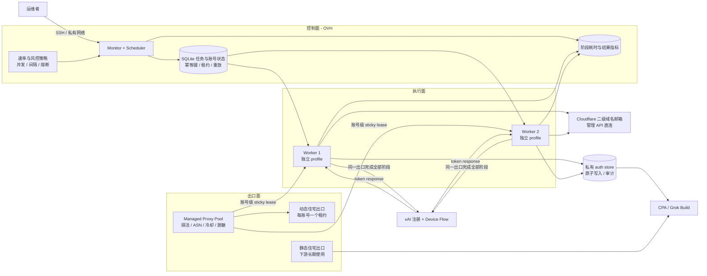

# 注册系统架构与运行流程

本文记录当前 OVH 部署、完整注册状态机、已确认故障根因、实测耗时，以及从
LINUX DO 帖子讨论和当前上游实现推导出的目标架构。

旧组件收敛、动态住宅 session、managed proxy pool、SQLite lease 和自动成功终态的
详细决策见[系统收敛、动态出口与可靠性闭环](CONVERGENCE_AND_GAPS.md)。

## 1. 文档口径

- 核验日期：2026-07-31（Asia/Shanghai）
- OVH 运行代码基线：`4d370a1`
- 当次上游 `main`：`d0b7c6cdf30e2193acd1e9eb6d56b0e5201daad1`
- OVH 成功样本：1 个完整 canary，包含邮箱 OTP、Turnstile、SSO、Device Flow、
  access/refresh token 和 Grok Build 数据面 `HTTP 200`
- 社区来源：[LINUX DO 主题 2673498](https://linux.do/t/topic/2673498)

本文使用以下证据等级：

| 标记 | 含义 |
|---|---|
| 已实测 | 在当前 OVH 上跑通并留有日志或 HTTP 结果 |
| 源码确认 | 能从当前仓库或官方上游代码确认 |
| 社区经验 | 帖子作者或回复者的环境经验，不视为稳定保证 |
| 工程推断 | 根据已有证据提出的设计建议，部署后仍需 canary 验证 |

## 2. 当前已部署架构

### 当前边界

- 控制台只监听 `127.0.0.1:18080`，通过 SSH 隧道访问。
- 邮箱管理流量走 OVH 直连，不经过注册代理。
- 当前注册出口也是 OVH 直连，因为原有住宅代理样本均返回 `407 Proxy
  Authentication Required`。
- 运行参数固定为 `batch=1`、`workers=1`、`max_slot_retry=0`。
- 新面板的 `cpa_auth/` 与现有 AI stack 的 CLIProxy auth volume 是两个目录；当前没有
  自动上传、挂载或热加载桥，因此“本地 auth 可独立探测”不等于“现有 API 已消费它”。
- 控制面和执行面仍在同一进程目录中共享 `config.json`、`log/`、`accounts/`
  和 `cpa_auth/`。这是可运行的单机架构，不是完整的任务队列架构。

## 3. 完整注册状态机

按照本文的运维验收口径，一个账号只有到最后一次数据面探测通过，才算完整成功。
当前面板的自动成功计数止于 token 写入，数据面探针仍是独立步骤。以下结果都不能
代替完整验收：

- 注册页能打开
- 邮箱 OTP 成功
- 获得 SSO cookie
- Device 页面显示 Authorized
- token 文件已经生成但尚未调用数据面

## 4. 之前故障的分层根因

之前看到的 `403`、`407` 和 `Access denied` 属于不同层，不能合并成一个
“OVH 网络有问题”。

| 现象 | 根因与证据 | 本次处理 |
|---|---|---|
| 面板在线但无法正常注册 | 旧配置仍使用占位域名，Cloudflare 管理鉴权和真实邮箱域名没有接入；面板存活不等于注册链路可用 | 接入已有二级域名邮箱，并完成建箱、SMTP 投递、邮件列表和正文读取 |
| 普通 `curl` 请求注册页返回 `403` | 同一 OVH 出口下，普通请求为 `403`，Chrome impersonation 和 Camoufox 为 `200`；这是边缘 WAF/请求指纹差异，不是 IP 整体封禁 | 预检使用 Chrome 指纹，正式流程使用 Camoufox |
| 住宅代理连接失败 | 当前代理池抽样返回 `407`，说明供应商凭据或订阅状态失效 | 保留代理材料但停用，当前 canary 使用已验证的 OVH 直连 |
| 账号创建后 token 端点 `Access denied` | 这是 OAuth/provider eligibility 层的拒绝；网络可达、Device 页面成功都不能证明 token 一定签发 | 使用当前 CPA 对齐的 scopes 和 Device Flow，保持单变量 canary，并以真实 token 请求验收 |

当前 scopes 已与 CPA xAI client 对齐。源码明确记录，额外申请未授权的
`conversations:*` scopes 会造成“consent 通过但 token 端点 Access denied”；但历史
provider denial 不应全部归因于 scope，因为同样可能受到账号或风控资格影响。

## 5. 实测耗时与速度边界

### OVH 完整成功 canary

日志时间为 2026-07-30 UTC，粒度为秒，单阶段误差约为 1 秒。

| 阶段 | 时间点 | 近似耗时 |
|---|---:|---:|
| 启动、预检、浏览器准备 | 17:33:01 -> 17:33:07 | 6 秒 |
| 账号开始到注册页就绪 | 17:33:07 -> 17:33:10 | 3 秒 |
| 注册页、建箱、提交邮箱 | 17:33:10 -> 17:33:28 | 18 秒 |
| 等待并提交 OTP | 17:33:28 -> 17:33:39 | 11 秒 |
| 资料页与 Turnstile | 17:33:39 -> 17:34:01 | 22 秒 |
| SSO cookie | 17:34:01 -> 17:34:02 | 1 秒 |
| Device Flow 与 token 落盘 | 17:34:02 -> 17:34:03 | 1 秒 |
| 账号主流程 | 17:33:07 -> 17:34:03 | **56 秒** |
| 从进程启动到 token 完成 | 17:33:01 -> 17:34:03 | **62 秒** |
| 独立 Grok Build 探针 | token 完成后单独执行 | **约 8 秒** |
| 含数据面探针的运维验收 | 两段实测合计 | **约 70 秒** |

本次最大可优化段是资料页 Turnstile，约占 18 至 21 秒。邮箱、页面网络和
Turnstile 都属于外部等待，不能用本地 CPU 优化到零。

### 帖子时间样本如何解读

- 回复 #138 约 21 秒，但最终命中 `botFlagSource=1 / policy=deny`，没有进入 OAuth，
  不是完整成功速度。
- 回复 #149 从账号开始到 Device Flow 结束约 54 秒，但 token 端点返回
  `Access denied`，同样不是完整成功。
- 社区的成功率、流量和每 IP 数量差异很大，只能作为容量规划输入。

### 可采用的速度目标

| 指标 | 当前值 | 稳健目标 | 说明 |
|---|---:|---:|---|
| 进程启动到 token 延迟 | 约 62 秒 | **35 至 45 秒** | 要求邮箱在 5 秒内到达、Turnstile 快速通过、Device Flow 无重试；不是 SLA |
| 含数据面验收 | 约 70 秒 | **40 至 55 秒** | 将最小 Grok Build 探针纳入完成口径 |
| 常见稳定区间 | 约 60 至 80 秒 | **50 至 70 秒** | 更适合作为完整运维验收的日常容量估算 |
| 当前并发 | 1 | **先 1，验证后最多 2** | 当前 OVH 为 2 vCPU / 3.7 GiB，先不要直接采用上游 2 至 3 的通用建议 |
| 2 worker 活跃吞吐 | 未启用 | **约 2 至 3 个 token-complete 账号/分钟** | 前提是两个独立健康出口；不含账号间隔、探针排队和风控冷却 |

当前 `account_interval=120-240` 是风控保护，不影响单账号 batch，但在连续任务中会
主动降低持续吞吐。生产目标应优先看完整成功率和每个可用 token 的成本，而不是只看
浏览器完成速度。

## 6. 帖子讨论得到的架构约束

以下均是社区经验，需要结合当前环境 canary 验证：

1. 注册邮箱使用二级域名。帖子多人报告一级域名更容易失败；当前 `.net` 二级域名
   已经实测成功，因此不能把 `.com` 当作硬性协议要求。
2. 注册阶段使用动态住宅出口，每个新账号换新出口；同一账号从注册、SSO 到 token
   换取期间保持 sticky，不在中途切换 IP。
3. 下游长期使用阶段更适合稳定的静态住宅出口，与注册用动态池分离。
4. 并发不是越大越快。帖子中高并发与空页、Turnstile 卡住、代理流量打满同时出现。
5. 对网络错误做短冷却，对 registration risk 做长冷却；邮箱错误不能错误处罚代理。
6. 链式出口应在 mihomo 等代理客户端完成，注册程序只看到一层 HTTP/SOCKS 入口。
7. 帖子中的流量估算从 1 GiB 约 30 至 250 个账号不等，供应商计费和失败重试会显著
   改变成本，不能直接作为预算承诺。

## 7. 推荐目标架构

对当前规模，最佳方案不是立刻拆成很多服务器，而是在单台 OVH 上先把控制、任务、
代理租约和凭据边界做清楚，再允许横向增加 worker。

### 推荐运行策略

- 邮箱面：保持 Cloudflare 管理 API 直连，继续使用已验证的二级域名。
- 注册面：使用受管动态住宅池，一个账号获取一个 lease，直到 OAuth 完成才释放。
- 使用面：CPA/Grok Build 走单独的稳定静态出口，不复用注册池的频繁轮换策略。
- worker：当前主机先运行 1 个；代理池和连续 canary 通过后升到 2 个，每个 worker
  必须拿到不同健康出口。
- 状态：每个账号持久化 `mail_created -> otp_received -> profile_submitted ->
  sso_acquired -> oauth_approved -> token_written -> data_plane_verified`。
- 重试：只重试明确的临时网络错误；provider denial、registration risk 和认证错误
  进入终态或冷却，不做无界重试。

## 8. 当前完成度与缺口

| 能力 | 当前状态 | 下一步 |
|---|---|---|
| 二级域名邮箱端到端 | 已完成 | 增加时延和失败率指标 |
| Chrome 指纹预检 + Camoufox | 已完成 | 保持与正式 worker 相同出口 |
| 单账号 Device Flow + 数据面验收 | 已完成 1 次人工 canary | 将数据面探针自动化为终态，不以文件数量代替健康度 |
| 安全控制台、loopback、Token、0600 | 已完成 | 可选接入 tailnet 或额外身份网关 |
| 新 panel auth 进入现有 CLIProxy 数据面 | 未完成 | 通过 loopback Management API 上传，确认热加载后从现有 API 路径探测 |
| 旧补号组件收敛 | 未完成 | 旧 5 容器约 155 MiB；auth 桥验收后先停 worker/browser/mail，controller 最后处理 |
| 旧文件代理轮换 | 部分完成 | 当前凭据 `407`，不能用于生产扩容 |
| 健康感知代理池与冷却 | 当前部署未完成 | 兼容合并上游 PR #6 的 `webui/proxy_store.py` |
| 账号级代理 lease | 部分完成 | 当前按 worker 索引绑定，缺少持久 lease 和崩溃归还 |
| 持久任务状态机与幂等 | 未完成 | 引入 SQLite；日志不再承担任务数据库职责 |
| 全局和每出口速率限制 | 未完成 | 加 token bucket、Retry-After 和独立出口预算 |
| 阶段级耗时指标 | 未完成 | JSONL 增加 phase timestamps / duration |
| 凭据静态加密 | 未完成 | 当前依赖 0600；后续接入主机密钥或外部 secret store |
| 注册出口与使用出口分离 | 未完成 | 有有效动态/静态住宅资源后再启用 |

上游 `d0b7c6c` 已合并[受管外部代理池 PR #6](https://github.com/lij768423-svg/grok-register-panel/pull/6)，
包含导入、探活、账号全流程固定出口、网络短冷却、风控长冷却和 fail-closed。
当前 OVH 分支同时包含精确邮箱域名、共享代理文件和安全默认值等本地修复，两条分支
已经发生代码级分叉，应该做兼容合并和回归测试，而不是直接覆盖线上目录。

2026-07-31 的现网审计还确认：register-panel 常驻内存约 14 至 26 MiB；项目磁盘约
1.6 GiB 主要由仍必需的 Camoufox cache（约 1.3 GiB）和 `.venv`（约 329 MiB）组成，
并不是旧容器残留。完整的保留/停用矩阵和回滚门禁见
[收敛文档第 2 节](CONVERGENCE_AND_GAPS.md#2-旧架构是否应该去掉)。

## 9. 实施顺序

1. **P0 - 先补 auth 桥**：通过 loopback Management API 将新 panel auth 同步到现有
   CLIProxy，验证文件热加载；密钥只从 0600 secret 读取。
2. **P0 - 建立真实成功门禁**：本次 token 精确探针、上传、热加载和现有 API 数据面
   全部通过后才写 `verified`，历史 `ok` 视为 `legacy_unverified`。
3. **P0 - 再补出口**：更新有效的动态住宅代理凭据，兼容合并上游 managed proxy
   pool；每账号生成一个 session 并全流程 sticky，保持 `workers=1` 做 canary。
4. **P1 - 持久状态**：加入 SQLite task/account 幂等键、proxy lease、心跳、死信和重放。
5. **P1 - 收敛旧组**：先停旧 worker、standby、browser context 和 mail relay；完成
   controller 能力替代并调整 cloudflared 后，才处理 controller。
6. **P1 - 再提并发**：连续样本稳定后升到 2 workers，要求两个独立健康 session；比较
   verified 成功率、P95 和单位成本，而不是只比较平均速度。
7. **P2 - 按需拆机**：只有单机 CPU、内存或浏览器稳定性成为真实瓶颈时，才拆分远程
   worker；控制面、邮箱和 auth store 仍保持单一事实来源。

## 10. 运维与验收入口

- 部署和回滚：[DEPLOYMENT.md](../DEPLOYMENT.md)
- 发布检查：[RELEASE_CHECKLIST.md](../RELEASE_CHECKLIST.md)
- 收敛与缺口：[CONVERGENCE_AND_GAPS.md](CONVERGENCE_AND_GAPS.md)
- 项目总览：[README.md](../README.md)
- 上游代理池提交：[`d0b7c6c`](https://github.com/lij768423-svg/grok-register-panel/commit/d0b7c6cdf30e2193acd1e9eb6d56b0e5201daad1)
